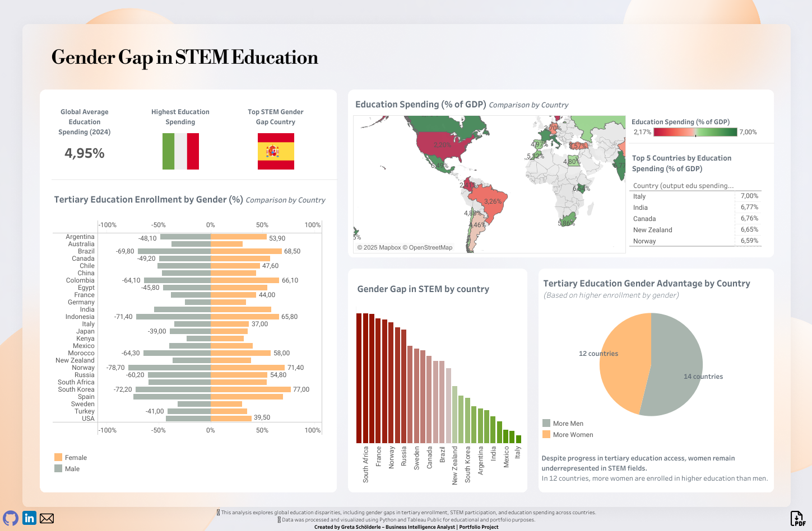

# Gender Gap in STEM & Education 📊

This data analysis project explores disparities in tertiary education access and representation in STEM (Science, technology, engineering, and mathematics) fields across different countries. Special attention is given to how participation varies by gender identity (in this case, male or female).

## 🔍 Overview

Using publicly available datasets (UNESCO, OECD, World Bank), this project analyzes:

- 📐 Representation in STEM education by gender
- 🎓 Tertiary education enrollment across countries
- 💸 Government spending on education (% of GDP)
- 📊 Global averages and country-level insights

The data was processed with **Python** and visualized using **Tableau Public**. Code and logic were developed using **VS Code**.


## 🛠️ Tools & Technologies

- **Python** – data wrangling (pandas)
- **VS Code** – development environment
- **Tableau Public** – interactive visualization

## 🧪 Code Snippet

This Python script calculates the gender gap in STEM and tertiary enrollment, and extracts insights on education spending:

```python
import pandas as pd

df = pd.read_csv("education_gender_data.csv")
df['stem_gender_gap'] = df['% Men in STEM'] - df['% Women in STEM']
df['tertiary_gender_gap'] = df['Tertiary Enrollment (Male)'] - df['Tertiary Enrollment (Female)']
df.to_csv("output_tertiary_gap.csv", index=False)

Full code available in education_gender_data.py

```

## 📊 Interactive Dashboard

> **View preview**  

> 
> **View live on Tableau**  
> [🌐 Gender Gap in STEM & Education – Tableau Public](https://public.tableau.com/views/GenderGapinSTEMEducation/viz?:language=es-ES&publish=yes&:sid=&:display_count=n&:origin=viz_share_link)

## 🧾 Credits

- Background map design: Pradeep Kumar G ([Twitter](https://x.com/pradeep_zen))
- Icons: flaticon.com  
- Flags: [Circle Flags](https://hatscripts.github.io/circle-flags/gallery)

## 🧠 Key Insight

> “In 68% of countries analyzed, female enrollment in tertiary education exceeds male enrollment — yet STEM fields still show major gender imbalance.”

## 📬 Contact

- GitHub: [@gschoelderle](https://github.com/gschoelderle)
- Email: [greta.schoelderle@gmail.com]

---

© 2025 Greta Schölderle. Licensed under MIT.
